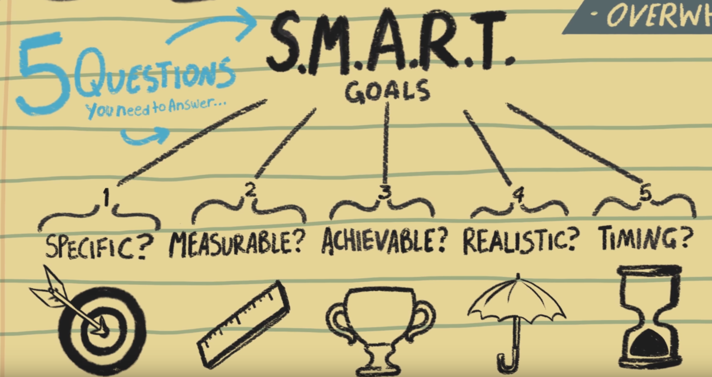
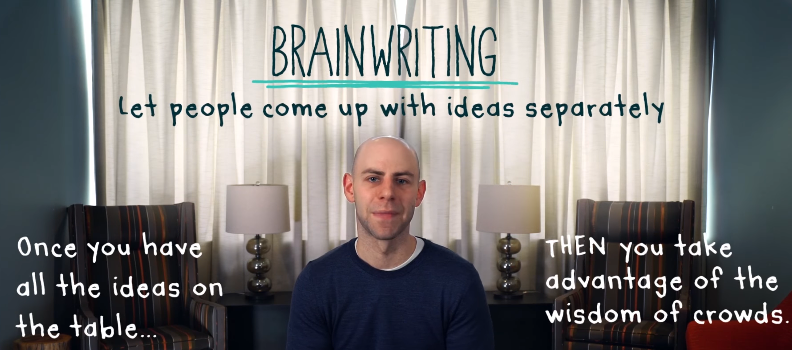
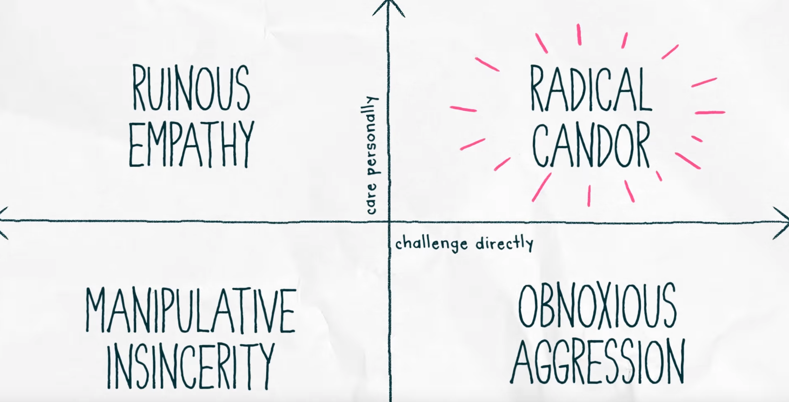

# On Leadership

- Watch the full series on YouTube [#DayOneInsights](https://www.youtube.com/hashtag/dayoneinsights)

Here are some summarized notes for some common aspects for leaders. This is targeted for
entrepreneurs but does apply to anyone who want to be a good leader

## [Amy Cuddy - Be the best boss](https://www.youtube.com/watch?v=1R49CMHpM6s)

- To be an effective leader
  - Your Likeability, Trustworthiness wins over Strength, confidence, decisiveness (and other
    attributes)
  - Let your team know, why they should trust you?
  - > Remember You don't get trust by default, you earn trust!

## [Susan Cain - How to lead introverts](https://www.youtube.com/watch?v=bbhctpQVyJk)

- You won't be able to lead introverts if you don't under who they are and what their needs are?
- There is no one size fits all strategy when it comes to team members
- Figure out the team, where each member complements each other and put them in a position to
  succeed

## [Mark Cuban - 3 essential rules for entrepreneurs](https://www.youtube.com/watch?v=rFls-kcnJxU&list=PLaQihAe6OdwLCqg2drq3k_LXyPh-WCcAR&index=2)

> When you are a manager, you have to be able to kick your own ass before someone else does it for
> you - Adapted from a quote by Mark cuban

- Selling is not convincing, but helping!
- All entrepreneur's lies to themselves, That are doing good, everybody loves us, However You should
  ...
  - Be brutally honest with yourself
  - What do we do well?
  - What do we not do well?
  - What are the challenges?
  - How can we improve upon them?

## Writing smart goals

- [Video](https://www.youtube.com/watch?v=XpSOb5q1cRo)
- Write your stretch goal
- Break it down into a plan
- Specific, Measurable, Achievable, Realistic, Timing (SMART)
  - **Specific**: How am I going to do this?
  - **Measurable**: What would success look like
  - **Achievable**: Is this achievable, if not lets tone it down a bit
  - **Realistic**: How can we realistically achieve this
  - **Timing**: How soon do we need to do this?

## How to give useful feedback

- [Kim Scott - How to give useful feedback](https://www.youtube.com/watch?v=UUJHgryZ1Hs)
- Think of feedback more as **guidance**
- We want, Good stuff people do => Do more of it => Give praise
- We want, Bad stuff people do => Stop doing it => Give criticism
- Give guidance with a spirit of being Humble, helpful
  - You are trying to help the person solve/fix a problem
  - You want to give guidance immediately and in-person
  - Remember: Feedback is measured **not at your mouth** but at the **other persons ear**
    - You need to see how the other person is reacting to the feedback
    - > You want to give praise in public and criticism in private
      - Praise is specific and sincere
      - Criticism is Kind and clear
    - Give praise/criticism about a persons behavior, You don't want to make it about their
      personality
    - Give a little criticism and lot of praise every single week

## [Adam Grant - The trick to successful brainstorming](https://www.youtube.com/watch?v=dIY_Zk3IiW4)

- See below images to understand problems with brainstorming and its solution
- > Ask people to write down their ideas separately in advance and then discuss

## [Kim Scott - Care personally. Challenge directly](https://www.youtube.com/watch?v=xWaJ2pkDiWU)

- 4 quadrants
  - **Radical candor** - Care personally + Challenge directly
    - Correct style ✅, Impromptu feedback delivered in person with compassion
    - Just say what you think
  - **Obnoxious aggression** - Challenge directly + Don't show that you care
    - You are just being a jerk
  - **Ruinous empathy** - Care personally + Don't challenge directly
    - Trying to be nice, but not help people improve
  - **Manipulative insincerity** - Don't care personally + Don't challenge directly
    - Political, passive aggressive, backstabbing behavior
  - Don't judge someone by their behaviors, but try to move more towards radical candor

Here is [another related video by Kim](https://www.youtube.com/watch?v=rFgu0nOHCcE)
